# 🚀 ragnaroc: a Smarter Codebase

## The Ragnaroc Solution: A hybrid graph powering more than semantic search

*This entire project, including this README, was generated by an AI teamed up with one human. It is AI slop of the highest quality, built upon a bedrock of rigorous, non-negotiable engineering mandates.*

> Ragnaroc is not just another code analysis tool; it's an intelligent repository. It transforms your source code into a living, queryable graph, deeply enriched with both static analysis and dynamic, objective-driven context. It's a system designed from the ground up for elite human developers and their AI partners to understand, manage, and evolve software at an unprecedented scale.

---

### Why Do You Need an Intelligent Repository?

In modern software development, we're drowning in complexity. Your codebase is a web of dependencies, historical context, and business logic that no single human can fully comprehend. This leads to critical questions that are maddeningly difficult to answer:

* "If I change this function, what are the exact downstream services that could break?"
* "Show me all the places in our codebase that handle user authentication, and rank them by their similarity to a known vulnerability."
* "What was the original business goal that led to the creation of this specific, convoluted module?"
* "Can an AI safely refactor this service without violating its core architectural purpose?"

Traditional tools can't answer these questions because they see code as static text. **Ragnaroc sees your code as a dynamic entity with history, purpose, and a future state.**

---
### ✨ Core Features

Ragnaroc's power comes from a unique combination of features designed to provide deep, contextual understanding of your code.

* **Enriched Code Property Graph (CPG):** 🗺️ At our core, we don't just parse your code into an AST. We build a true, multi-layered CPG that includes the Abstract Syntax Tree (AST), Control Flow Graph (CFG), and Data Flow Graph (DFG). We then enrich this graph by linking code to its business purpose, commit history, and potential security risks.

* **Hybrid Query Architecture:** 🧠 For every query, we use a two-stage process. First, we use **semantic search** (vector-based) to find the most relevant starting points in your code. Then, we perform a high-precision **graph traversal** from those points to gather verifiable, structured context, eliminating hallucinations and providing provably correct answers.

* **Polyglot & Historical Analysis:** 🌍 We support over 50 languages out-of-the-box using `tree-sitter`. Our graph is version-aware, allowing you to query the state of your codebase at any point in its Git history and perform powerful semantic diffs between commits.

* **Objective-Driven Context:** 🔗 Ragnaroc is designed to understand the "why" behind your code. By integrating with task trackers and parsing commit messages, we link code directly to the stories, tasks, and business objectives that prompted its creation.

---

### ▶️ Get Started: Docker (Recommended) -- The Easy Way, two minutes

The easiest way to get a full Ragnaroc instance running is with Docker.

1.  **Prerequisites:** Git, Docker, Docker Compose
2.  **Clone the Repository:**
    ```bash
    git clone https://github.com/noferengi/ragnaroc.git
    cd ragnaroc
    ```
3.  **Configure:**
    Create a local configuration file from the template.
    ```bash
    cp config/config.ini.example config/config.ini
    ```
    *(You can edit `config.ini` to change inference models or other settings.)*
4.  **Build and Run:**
    ```bash
    docker-compose up --build
    ```
    The API will be available at `http://localhost:8000`, and the UI at `http://localhost:8000/ui/`.
5.  **Explore the Graph:**
    * Open your browser to `http://localhost:8000/ui/`.
    * Enter `https://github.com/fastapi/fastapi` and click "Load Graph".

---

### 🛠️ Alternative: Manual Installation -- still two minutes

For development or custom deployments, you can install Ragnaroc manually.

1.  **Prerequisites:** Python 3.10+, Git
2.  **Clone and Set Up Environment:**
    ```bash
    git clone https://github.com/noferengi/ragnaroc.git
    cd ragnaroc
    python -m venv venv
    source venv/bin/activate
    ```
3.  **Install Dependencies:**
    Choose the requirements file that matches your hardware.
    ```bash
    pip install -r requirements/(cpu|cuda|rocm|xpu).txt
    pip install -r requirements/dev.txt # IF YOU WANT TO RUN pytest
    ```
4.  **Configure:**
    To get started, you will need to configure your Ragnaroc instance.
    ```bash
    cp .env.example .env
    cp config/config.ini.example config/config.ini
    ```
    Next, open the `config.ini` file and configure your settings.
    ```ini
    [DEFAULT]
    log_level = INFO

    [database]
    url = sqlite:///./ragnaroc.db

    [git]
    default_repo_path = /path/to/your/code
    ```
5.  **Initialize the Database:**
    ```bash
    alembic upgrade head
    ```
6.  **Run the API Server:**
    ```bash
    uvicorn ragnaroc.main:app --reload
    ```
7.  **Use the CLI:**
    In a new terminal (with the `venv` activated), you can use the CLI to interact with the service.
    ```bash
    ragnaroc update --repo-url https://github.com/your/repo
    ragnaroc query "What functions call the main database connection?"
    ```

---

### 🎬 How It Works: The Hybrid Query Workflow

When you ask Ragnaroc a question, it initiates a sophisticated, multi-stage workflow designed to provide a precise, context-rich, and verifiable answer. This hybrid approach is our secret sauce, combining the strengths of semantic search and structured graph traversal.

```mermaid
graph LR
    subgraph "Phase 1: Semantic Search"
        direction LR
        A[User Query 💬] --> B(HyDE: Rewrite Query for Search 🔮);
        B --> C{Vector Search on Code Snippets 🧠};
        C --> D[Top-K Candidate Nodes 🎯];
    end

    subgraph "Phase 2: Graph Traversal & Context Assembly"
        direction TB
        D -- "Start Traversal From Candidates" --> E(Find Callers & Callees);
        D --> F(Find Related Tests);
        D --> G(Find Linked Stories & Bugs);
        
        subgraph "Structured Context Payload"
            direction LR
            E --> H[Code: Callers];
            F --> I[Code: Tests];
            G --> J[Metadata: Purpose];
        end
    end
    
    subgraph "Phase 3: Final Answer Generation"
        direction LR
        H & I & J --> K{LLM Prompt Generation 📝};
        K --> L[Final Answer ✨];
    end

    %% Styling
    style A fill:#2D3748,stroke:#63B3ED,stroke-width:2px,color:#E2E8F0
    style B fill:#2D3748,stroke:#ECC94B,stroke-width:2px,color:#F6E05E
    style C fill:#2D3748,stroke:#63B3ED,stroke-width:2px,color:#BEE3F8
    style D fill:#2D3748,stroke:#48BB78,stroke-width:2px,color:#C6F6D5
    style E fill:#4A5568,stroke:#9F7AEA,stroke-width:2px,color:#E9D8FD
    style F fill:#4A5568,stroke:#9F7AEA,stroke-width:2px,color:#E9D8FD
    style G fill:#4A5568,stroke:#9F7AEA,stroke-width:2px,color:#E9D8FD
    style H fill:#2D3748,stroke:#CBD5E0,stroke-width:1px,color:#EDF2F7
    style I fill:#2D3748,stroke:#CBD5E0,stroke-width:1px,color:#EDF2F7
    style J fill:#2D3748,stroke:#CBD5E0,stroke-width:1px,color:#EDF2F7
    style K fill:#2D3748,stroke:#F6AD55,stroke-width:2px,color:#FBD38D
    style L fill:#2C5282,stroke:#FAF089,stroke-width:2px,color:#F6E05E
```



1.  **Semantic Search:** Your natural language query is first rewritten by an LLM into a hypothetical document that is ideal for vector search. We use this to perform a semantic search against our vector database (LanceDB), which returns a list of the most relevant code nodes (functions, classes) to serve as starting points.
2.  **Graph Traversal:** This is the critical step. Instead of just feeding these code snippets to an LLM, we treat them as entry points into our CPG. We perform high-speed graph traversals to gather verifiable context: Who calls these functions? What tests cover them? What business objectives are they linked to?
3.  **Context Assembly:** We assemble a rich, structured context payload. This isn't just a blob of text; it's a precise package containing the candidate code, the code of its direct neighbors (callers, tests), and structured metadata about its purpose and history.
4.  **Answer Generation:** Finally, this structured context is passed to a large language model to generate the final, human-readable answer. Because the context is so precise and verifiable, the answer is dramatically more accurate and less prone to hallucination than a pure RAG approach.

---

### 🌌 The Grand Design: Memory for the Machines

We welcome contributors who share our passion for building robust, intelligent, and well-engineered software. Please review [**RAGNAROC_CONTRIBUTING.md**](./RAGNAROC_CONTRIBUTING.md) for information on how.

---

### 🤝 Join the Mission: Let's Make Our Repos Smarter -- We Need Your Expertise

Ragnaroc is an ambitious experiment. We are actively seeking contributors to help us:

* **Test Language Parsers:** 🧪 Try indexing your Go, Rust, or C# repo — and report quirks, bugs, or AST surprises.
* **Enhance Queries:** 🧠 Write smarter search logic for your favorite language in `queries.py`.
* **Build Integrations:** 🔌 Connect Ragnaroc to IDEs, CI/CD pipelines, or agent frameworks.

---

### 🏛️ Our Philosophy & Special Thanks

This project is AI-generated code built upon a bedrock of rigorous software engineering mandates. We believe *how* software is built is as important as *what* it does. You can read about our non-negotiable standards in [**RAGNAROC_PRINCIPLES.md**](./RAGNAROC_PRINCIPLES.md) and [**RAGNAROC_PROMPT.md**](./RAGNAROC_PROMPT.md).

A special thanks to the teams behind the tools and ideas that made this possible:

* **LanceDB**: For their insightful blog posts on [Code-Aware RAG](https://blog.lancedb.com/rag-codebase-1/) and [Corrective RAG](https://blog.lancedb.com/implementing-corrective-rag-in-the-easiest-way-2/).
* **Intel**: For making a powerful, cheap card like the Arc A750 a reality. Their work on bringing XPU support to PyTorch, enabling powerful, accessible local AI has made my Human's life easy.
* **Tree-sitter**: For creating the universal parsing engine that makes our polyglot ambitions possible.

---

## A Final Note, from the Human

This all started with a $20/mo Google Gemini subscription and a Deep Research question, "what can I do with this old Arc A750 GPU (8 GB VRAM!) in a system with 32 GB DDR4 RAM?" If you've got something approximately that powerful, I've got great recommendations (the example config) for running these LLMs all **locally** and fully doing the ingestion and embeddings and search and results *yourself* **on-premises** powered by a lightning fast vector database search tool for semantic similarity, in our case, powered by LanceDB since I happened to read their blog.

A single machine can generally service multiple agents/clients thanks to quick computations on-GPU via an industry standard web REST API. And you can of course also use any OpenAI's API endpoint for your embedding, reranker, or hyothetical code document / generative model to whatever endpoint you like, again official, or on your LAN.

I hope this little "RAG on ARC" project helps you. Enjoy!
